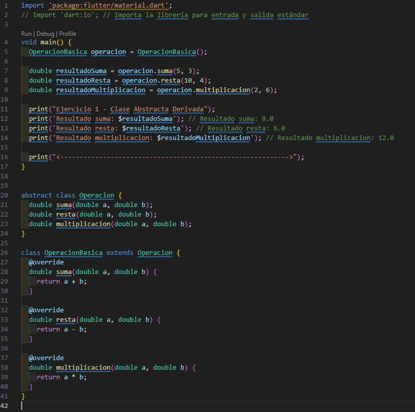
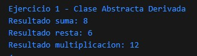
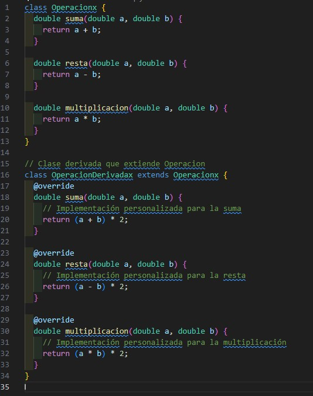
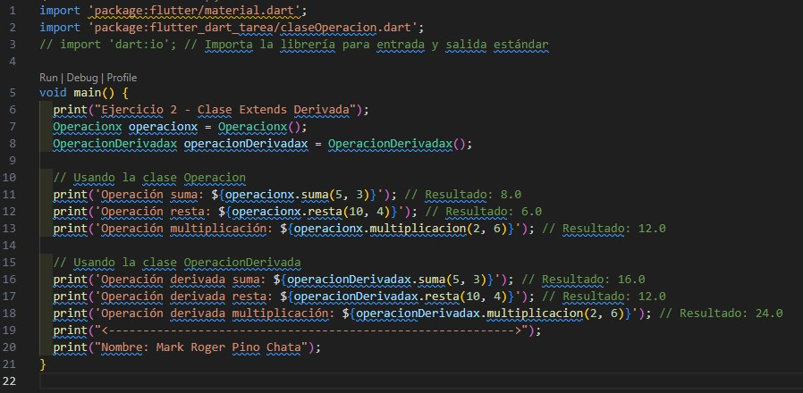
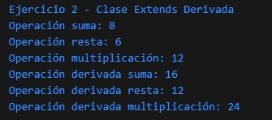

# Tarea

## Ejercicio 1
Elaborar una clase abstracta `Operacion` con los métodos `suma`, `resta` y `multiplicación`, y luego implementar en una clase derivada.

### Código

### Resultado

---

## Ejercicio 2
Realizar una clase `Operacion` con los métodos `suma`, `resta` y `multiplicación`. Después, extender en una clase derivada.

### Código

### Resultado

