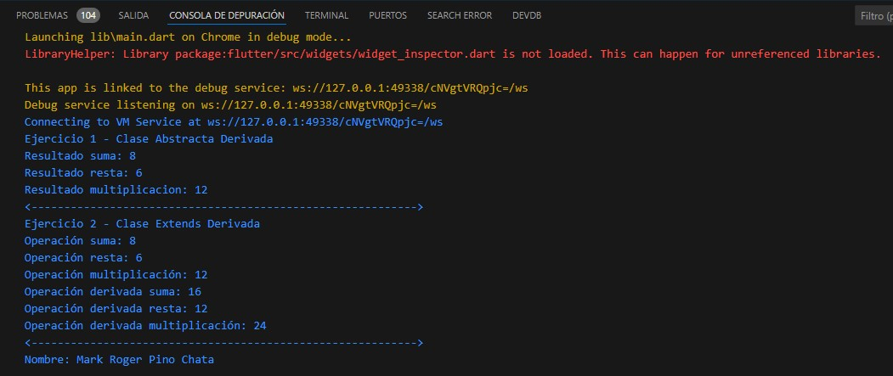

# Tarea

## Ejercicio 1
Elaborar una clase abstracta operación con los métodos suma, resta y multiplicación. 
Luego, implementar en una clase derivada.

1. Código
    

2. Resultado
   

## Ejercicio 2
Realizar una clase operación con los métodos suma, resta y multiplicación. Después, 
extender en una clase derivada.

1. Código
    
    

2. Resultado
   